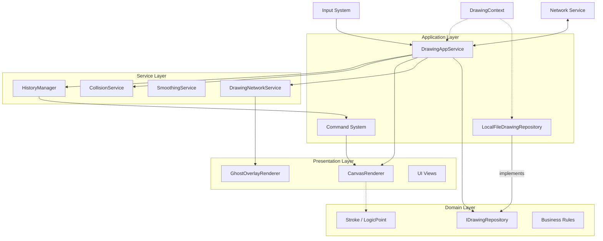

# Drawer 项目 - AI 开发者手册

> **角色定义**: 本文档是 AI Agent（以及人类开发者）在 Drawer 项目工作时的主要事实来源。它定义了架构约束、核心概念和编码标准，**必须**遵循这些内容以保持系统的完整性。
>
> **维护规则**: 每当系统架构或核心模式发生修改时，**必须首先**更新此文件以反映更改。

## 1. 项目概览

**Drawer** 是一个基于 Unity 构建的高性能、低延迟 2D 绘图应用程序。它优先考虑输入响应性、跨分辨率一致性和健壮的状态管理。

*   **核心目标**: 具有 < 33ms 延迟的原生般书写体验。
*   **技术栈**: Unity 2021.3+ (LTS), C#, UGUI。
*   **架构**: 领域驱动设计 (DDD) 与分层架构。
*   **关键约束**: 关键路径（Update/Draw 循环）中 **零 GC (Zero-GC)**。

## 2. 核心概念与术语

理解这些术语对于任何代码修改都是强制性的。

| 术语 | 定义 | 上下文/用法 |
| :--- | :--- | :--- |
| **LogicPoint** | 与分辨率无关的坐标结构体。使用 `ushort` (0-65535) 表示 X/Y，以确保跨设备的确定性行为。 | `Domain/ValueObject` |
| **StampData** | 代表单个画笔图章（位置、旋转、大小）的结构体。 | `Domain/ValueObject` |
| **Stroke** | 绘图的基本实体。包含 `LogicPoint` 列表、画笔 ID、颜色、随机种子和唯一 ID。 | `Domain/Entity` |
| **Command Pattern** | 所有状态更改（绘制、擦除、清除）都封装为 `ICommand` 对象，以支持撤销/重做和序列化。 | `App/Command` |
| **Spatial Index** | 一种基于网格的空间哈希系统，用于加速橡皮擦碰撞检测。 | `Service/StrokeSpatialIndex` |
| **LogicToWorld** | 将 `LogicPoint` (0-65535) 转换为世界空间（像素）的比率。根据 Canvas 分辨率动态变化。 | `DrawingConstants`, `AppService` |
| **Ghost Layer** | 一个临时的覆盖层，用于在远程笔画提交到历史记录之前实时渲染它们。 | `Presentation/GhostOverlayRenderer` |
| **Delta Compression** | 一种通过存储相对于前一个点的差异来压缩笔画点的技术。 | `Service/Network/StrokeDeltaCompressor` |
| **Structured Log** | 包含 `TraceId` 和 `Context` 的 JSON 格式日志，用于启用可观测性。 | `Common/Diagnostics` |

## 3. 系统架构

系统遵循严格的单向数据流和分层分离。

### 3.1 架构图

### 3.2 层级职责

1.  **Presentation (Unity)**:
    *   **CanvasRenderer**: 处理 `CommandBuffer`, `Mesh`, `Material`。**纯视觉表现**。实现 `IStrokeRenderer` 和 `ICanvasResolutionProvider`。
    *   **CanvasLayoutController**: 管理分辨率/宽高比和 RenderTextures（与 Renderer 分离）。
    *   **GhostOverlayRenderer**: 处理远程笔画的临时渲染。实现 `IGhostRenderer`。
    *   **规则**: 永远不要在这里放置业务逻辑。使用 **保留模式 (Retained Mode)**。必须通过 `IDrawingFacade` 与应用层通信。
2.  **Application (App)**:
    *   **DrawingContext (Composition Root)**: 负责依赖注入和组件装配。
    *   **DrawingAppService**: "大脑"。协调 Input -> Logic -> Rendering -> Network -> Persistence。实现 `IDrawingFacade`。
    *   **Data**: `LocalFileDrawingRepository` 实现数据持久化。
    *   **规则**: 管理 `TraceContext`。处理依赖注入。
3.  **Service (Logic)**:
    *   **HistoryManager**: 管理撤销/重做堆栈。
    *   **StrokeCollisionService**: 处理橡皮擦逻辑。
    *   **DrawingNetworkService**: 处理数据包缓冲、压缩和 Ghost 状态管理。
    *   **规则**: 尽可能无状态。负责繁重的计算。
4.  **Domain (Core)**:
    *   **Entities**: POCOs (Plain Old C# Objects)。
    *   **Interfaces**: 定义 `IDrawingRepository` 等核心接口。
    *   **Logic**: 纯数学逻辑 (例如 `StrokeStampGenerator`)。
    *   **规则**: **无 Unity 引擎依赖**（必要时除基本数学类型外）。

## 4. 关键模块与实现细节

### 4.1 DrawingAppService (门面)
*   **职责**: 所有绘图操作的入口点。实现 `IDrawingFacade`。
*   **关键逻辑**:
    *   **输入状态**: 将画笔/颜色/大小状态委托给 `InputStateManager`。
    *   **动态分辨率**: 监听 `OnResolutionChanged` 以更新 `LogicToWorldRatio`。
    *   **诊断**: 将 `TraceContext` 注入每个笔画生命周期。
    *   **状态同步**: 在处理输入之前，**必须**通过 `InputStateManager.SyncToRenderer()` 重新同步 Renderer 状态。
    *   **网络钩子**: 在 Start/Move/End 笔画事件上调用 `DrawingNetworkService`。

### 4.2 CanvasRenderer (画师)
*   **职责**: GPU 加速渲染。
*   **优化**:
    *   **初始化**: 使用显式 `Initialize()` 方法（同步）。无协程。
    *   **Shader 预热**: 在 `InitializeGraphics` 中使用 `ShaderVariantCollection` 以防止第一笔卡顿。
    *   **资源清理**: 在 `OnDestroy` 中显式销毁 Materials/Meshes。

### 4.3 StrokeCollisionService (橡皮擦)
*   **算法**: 空间哈希 + 欧几里得距离。
*   **优化**:
    *   **去重**: 过滤掉离前一个点太近的橡皮擦点（画笔大小的 10%）。
    *   **有效性检查**: 丢弃未击中任何墨迹的橡皮擦笔画（节省历史空间）。

### 4.4 DrawingNetworkService (信使)
*   **职责**: 实时同步。
*   **协议**: 混合同步 (Ghost Layer + Commit)。
*   **关键逻辑**:
    *   **Delta 压缩**: 使用 `StrokeDeltaCompressor` (VarInt + Relative) 最小化带宽。
    *   **自适应批处理**: 聚合点（10 个计数或 33ms）以平衡开销和延迟。
    *   **冗余**: 在数据包中包含前一批数据以从丢包中恢复（1 个数据包回溯）。
    *   **载荷长度**: `UpdateStroke` 数据包携带显式载荷长度；接收者必须遵守长度（池化缓冲区可能大于逻辑数据）。
    *   **载荷所有权**: `SendUpdateStroke` 将载荷缓冲区视为临时的；如果异步使用，客户端必须复制。调用者可以在发送后立即回收池化缓冲区。
    *   **校验和**: `EndStroke` 包含对每个 `LogicPoint` 的 `(X,Y,Pressure)` 顺序计算的校验和 (FNV-1a 32-bit)。用于检测不同步；严格模式下可拒绝不匹配。
    *   **画笔验证**: 当启用严格/白名单验证时，可以拒绝 `UNKNOWN_BRUSH_ID`。
    *   **构建默认值**: 在 Debug/Development 中，严格验证 + 未知拒绝默认开启。Release 默认关闭（通过 `_useBuildDefaults` 覆盖）。
    *   **预测**: 使用客户端外推（基于速度）来掩盖 Ghost Layer 中的网络抖动。
    *   **Ghost 渲染**: 在保留循环中驱动 `GhostOverlayRenderer`。
    *   **提交**: 在 `EndStroke` 时，重建完整的 `StrokeEntity` 并将其提交给 `DrawingAppService`。

## 5. AI Agent 开发指南

在生成或修改代码时，你**必须**遵守这些规则：

### 5.1 性能规则 (严格)
1.  **零分配 (Zero Allocation)**:
    *   ❌ 在 `Update` 或 `MoveStroke` 中 `new List<T>()`。
    *   ✅ 使用预分配的 `private List<T> _buffer`。
2.  **字符串拼接**:
    *   ❌ 在日志/循环中 `string + string`。
    *   ✅ 使用 `StringBuilder` 或结构化日志。
3.  **循环优化**:
    *   在热路径（绘图循环）中优先使用 `for` 而不是 `foreach`。

### 5.2 编码标准
1.  **依赖注入**:
    *   为 MonoBehaviours 使用 `Initialize(...)` 方法以允许测试注入。
    *   示例: `public void Initialize(IStrokeRenderer renderer, ...)`
2.  **诊断**:
    *   注入 `IStructuredLogger`。
    *   使用 `TraceId` 记录高级事件（笔画 Start/End）。
3.  **常量**:
    *   使用 `DrawingConstants` 存储魔术数字（分辨率、压力）。

### 5.3 文档维护
*   **规则**: 如果更改了架构或 API 签名，你**必须**更新此文件 (`AGENTS.md`) 和 `docs/` 中的相关文件。

## 6. 配置与故障排除

### 6.1 关键配置
*   **DrawingConstants.cs**:
    *   `LOGICAL_RESOLUTION = 65536` (无迁移请勿更改)。
    *   `LOGIC_TO_WORLD_RATIO`: 默认回退比率。
*   **Shaders**:
    *   `Resources/Shaders/DrawingShaderVariants`: 必须分配给 `CanvasRenderer`。

### 6.2 常见问题与修复
| 症状 | 可能原因 | 修复 |
| :--- | :--- | :--- |
| **第一笔卡顿** | Shader 未预热。 | 运行 `Tools/Drawing/Assign Shader Variants`。 |
| **橡皮擦未命中/偏移** | `LogicToWorldRatio` 不匹配。 | 确保在调整大小时调用 `UpdateResolutionRatio`。 |
| **内存泄漏** | Native 资源未释放。 | 检查 `CanvasRenderer` 中的 `OnDestroy`。 |
| **粉色材质** | Shader 从构建中剥离。 | 将 Shader 添加到 `Always Included Shaders`。 |

## 7. 部署与验证

### 7.1 提交前检查清单
1.  [ ] **单元测试**: 运行 `DiagnosticsTests` 和逻辑测试。
2.  [ ] **零 GC 检查**: 验证 `MoveStroke` 中无分配。
3.  [ ] **文档**: 如果架构更改，更新 `AGENTS.md`。

### 7.2 日志与监控
*   **本地**: 检查 Unity 控制台中的 `[PerformanceHeartbeat]`。
*   **生产**: 确保 `StructuredLogger` 连接到持久化接收器（文件/网络）。

## 8. 核心架构原则与技术规范

设计一个优秀软件项目架构时应遵循的核心架构原则和技术规范：

### 8.1 基础架构原则
1.  **分层架构原则**
    *   采用清晰的分层结构（表现层、业务逻辑层、数据访问层、基础设施层）。
    *   各层之间通过定义良好的接口进行解耦，避免跨层直接依赖。
    *   实现依赖倒置原则，高层模块不依赖低层模块的具体实现。
2.  **单一职责原则（SRP）**
    *   每个模块、类、函数只负责一个明确的职责。
    *   避免功能耦合，确保代码的可维护性和可测试性。
    *   建立清晰的模块边界和职责划分文档。
3.  **开闭原则（OCP）**
    *   架构设计应对扩展开放，对修改关闭。
    *   通过抽象、接口、策略模式等机制实现可扩展性。
    *   建立插件化架构，支持新功能的动态添加。
4.  **依赖注入和控制反转（IoC/DI）**
    *   实现松耦合的组件依赖关系。
    *   使用依赖注入框架管理对象生命周期。
    *   建立统一的配置管理机制。

### 8.2 业务与领域
5.  **领域驱动设计（DDD）**
    *   以业务领域为核心进行架构设计。
    *   建立统一的领域模型和通用语言。
    *   划分限界上下文，管理复杂业务逻辑。
6.  **微服务/模块化架构原则**
    *   服务/模块拆分遵循业务边界。
    *   实现服务/模块间的松耦合和高内聚。
    *   建立服务发现、配置管理、监控告警等基础设施（针对分布式场景）。

### 8.3 数据与安全
7.  **数据架构原则**
    *   实现数据一致性策略（最终一致性或强一致性）。
    *   建立数据访问抽象层，支持多数据源。
    *   实现数据缓存策略，提升系统性能。
8.  **安全架构原则**
    *   实现多层次安全防护（认证、授权、加密、审计）。
    *   遵循最小权限原则。
    *   建立安全漏洞扫描和修复机制。

### 8.4 性能与可靠性
9.  **性能架构原则**
    *   实现水平扩展能力。
    *   建立性能监控和调优机制。
    *   设计合理的缓存策略和异步处理机制。
10. **可观测性原则**
    *   实现完整的日志、指标、链路追踪体系。
    *   建立统一的监控告警平台。
    *   支持快速问题定位和性能分析。
11. **容错和弹性设计**
    *   实现熔断、限流、重试等容错机制。
    *   设计优雅降级策略。
    *   建立健康检查和自动恢复机制。

### 8.5 工程实践
12. **技术债务管理**
    *   建立代码质量门禁和自动化检查。
    *   定期进行架构评审和重构。
    *   维护架构决策记录（ADR）。
13. **交付和部署原则**
    *   实现自动化构建、测试、部署流水线。
    *   支持蓝绿部署、滚动升级等策略。
    *   建立环境一致性和配置管理机制。
14. **文档和知识管理**
    *   维护完整的架构文档、API文档、部署文档。
    *   建立知识库和最佳实践指南。
    *   定期进行团队架构培训和技术分享。
