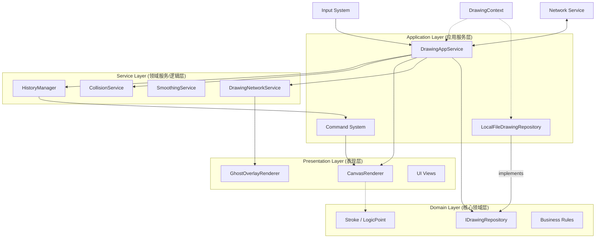

# Drawer 项目 - AI 开发者手册

> **角色定义**: 本文档是 AI Agent（以及人类开发者）在 Drawer 项目工作时的主要事实来源。它定义了架构约束、核心概念和编码标准，**必须**遵循这些内容以保持系统的完整性。
>
> **维护规则**: 每当系统架构或核心模式发生修改时，**必须首先**更新此文件以反映更改。

## 1. 项目概览

**Drawer** 是一个基于 Unity 构建的高性能、低延迟 2D 绘图应用程序。它优先考虑输入响应性、跨分辨率一致性和健壮的状态管理。

*   **核心目标**: 具有 < 33ms 延迟的原生般书写体验。
*   **技术栈**: Unity 2021.3+ (LTS), C#, UGUI。
*   **架构**: 领域驱动设计 (DDD) 与分层架构。
*   **关键约束**: 关键路径（Update/Draw 循环）中 **零 GC (Zero-GC)**。

## 2. 核心概念与术语

理解这些术语对于任何代码修改都是强制性的。

| 术语 | 定义 | 上下文/用法 |
| :--- | :--- | :--- |
| **LogicPoint** | 与分辨率无关的坐标结构体。使用 `ushort` (0-65535) 表示 X/Y，以确保跨设备的确定性行为。 | `Domain/ValueObject` |
| **StampData** | 代表单个画笔图章（位置、旋转、大小）的结构体。 | `Domain/ValueObject` |
| **Stroke** | 绘图的基本实体。包含 `LogicPoint` 列表、画笔 ID、颜色、随机种子和唯一 ID。 | `Domain/Entity` |
| **Command Pattern** | 所有状态更改（绘制、擦除、清除）都封装为 `ICommand` 对象，以支持撤销/重做和序列化。支持逐笔撤销。 | `App/Command` |
| **History Sliding Window** | 保持最近 50 个命令为“活跃”状态以便快速撤销/修改。超出窗口的命令将被“烘焙”到底层并归档。 | `Service/HistoryManager` |
| **Spatial Index** | 一种基于网格的空间哈希系统，用于加速橡皮擦碰撞检测。 | `Service/StrokeSpatialIndex` |
| **LogicToWorld** | 将 `LogicPoint` (0-65535) 转换为世界空间（像素）的比率。根据 Canvas 分辨率动态变化。 | `DrawingConstants`, `AppService` |
| **Ghost Layer** | 一个临时的覆盖层，用于在远程笔画提交到历史记录之前实时渲染它们。 | `Presentation/GhostOverlayRenderer` |
| **Delta Compression** | 一种通过存储相对于前一个点的差异来压缩笔画点的技术。 | `Service/Network/StrokeDeltaCompressor` |
| **Structured Log** | 包含 `TraceId` 和 `Context` 的 JSON 格式日志，用于启用可观测性。 | `Common/Diagnostics` |

## 3. 系统架构

系统遵循严格的单向数据流和分层分离。

### 3.1 架构图



**分层依赖规则**:
1.  **Presentation** (UI/View) -> **Application** (Facade/AppService)
2.  **Application** -> **Service** (Domain Services) & **Domain** (Entities/Interfaces)
3.  **Service** -> **Domain**
4.  **Infrastructure** (Data Impl) -> **Domain** (Interfaces) [依赖倒置]
5.  ❌ **禁止逆向依赖** (例如: Domain 引用 Application，Service 引用 Presentation)

### 3.2 层级职责

1.  **Presentation (Unity)**:
    *   **CanvasRenderer**: 处理 `CommandBuffer`, `Mesh`, `Material`。**纯视觉表现**。实现 `IStrokeRenderer` 和 `ICanvasResolutionProvider`。使用 **Mesh Stamping** 技术进行绘制。支持异步初始化 (`InitializeAsync`) 以预热资源。
    *   **CanvasLayoutController**: 管理分辨率/宽高比和 RenderTextures（与 Renderer 分离）。
    *   **GhostOverlayRenderer**: 处理远程笔画的临时渲染。实现 `IGhostRenderer`。
    *   **规则**: 永远不要在这里放置业务逻辑。使用 **保留模式 (Retained Mode)**。必须通过 `IDrawingFacade` 与应用层通信。
2.  **Application (App)**:
    *   **DrawingContext (Composition Root)**: 负责依赖注入和组件装配。**必须**通过此组件启动应用，不再支持 Fallback 初始化。
    *   **DrawingAppService**: "大脑"。协调 Input -> Logic -> Rendering -> Network -> Persistence。实现 `IDrawingFacade`。
    *   **Data**: `LocalFileDrawingRepository` 实现数据持久化。
    *   **规则**: 管理 `TraceContext`。处理依赖注入。
3.  **Service (Logic)**:
    *   **HistoryManager**: 管理撤销/重做堆栈。实现滑动窗口策略（保留最近 50 笔活跃）。
    *   **StrokeCollisionService**: 处理橡皮擦逻辑。
    *   **DrawingNetworkService**: 处理数据包缓冲、压缩和 Ghost 状态管理。
    *   **规则**: 尽可能无状态。负责繁重的计算。
4.  **Domain (Core)**:
    *   **Entities**: POCOs (Plain Old C# Objects)。
    *   **Interfaces**: 定义 `IDrawingRepository` 等核心接口。
    *   **Logic**: 纯数学逻辑 (例如 `StrokeStampGenerator`)。
    *   **规则**: **无 Unity 引擎依赖**（必要时除基本数学类型外）。

## 4. 关键模块与实现细节

### 4.1 DrawingAppService (门面)
*   **职责**: 所有绘图操作的入口点。实现 `IDrawingFacade`。
*   **关键逻辑**:
    *   **输入状态**: 将画笔/颜色/大小状态委托给 `InputStateManager`。
    *   **动态分辨率**: 监听 `OnResolutionChanged` 以更新 `LogicToWorldRatio`。
    *   **诊断**: 将 `TraceContext` 注入每个笔画生命周期。
    *   **状态同步**: 在处理输入之前，**必须**通过 `InputStateManager.SyncToRenderer()` 重新同步 Renderer 状态。
    *   **网络钩子**: 在 Start/Move/End 笔画事件上调用 `DrawingNetworkService`。

### 4.2 CanvasRenderer (画师)
*   **职责**: GPU 加速渲染，使用 Mesh Stamping 技术。
*   **优化**:
    *   **初始化**: 使用显式 `InitializeAsync()` 方法（异步协程）。支持 Shader 变体预热和计算着色器加载。
    *   **Shader 预热**: 在 `InitializeAsync` 中使用 `ShaderVariantCollection` 以防止第一笔卡顿。
    *   **资源清理**: 在 `OnDestroy` 中显式销毁 Materials/Meshes。
    *   **状态重置**: 依赖 `StartStroke` 来重置内部的 `StrokeStampGenerator` 状态，确保插值正确。

### 4.3 StrokeCollisionService (橡皮擦)
*   **算法**: 空间哈希 + 欧几里得距离。
*   **优化**:
    *   **去重**: 过滤掉离前一个点太近的橡皮擦点（画笔大小的 10%）。
    *   **有效性检查**: 丢弃未击中任何墨迹的橡皮擦笔画（节省历史空间）。

### 4.4 HistoryManager (时间守护者)
*   **职责**: 维护 `Undo`/`Redo` 栈和命令生命周期。
*   **策略**:
    *   **逐笔撤销**: `Undo` 操作仅弹出栈顶的单个命令，并触发重绘。
    *   **滑动窗口**: 保持最近 50 个命令为“活跃”状态（在内存中作为对象）。旧于此的命令被“烘焙”到背景纹理并归档，以控制内存使用和重绘成本。
    *   **边界检查**: 防止在空栈上执行撤销。

### 4.5 DrawingNetworkService (信使)
*   **职责**: 实时同步。
*   **协议**: 混合同步 (Ghost Layer + Commit)。
*   **关键逻辑**:
    *   **Delta 压缩**: 使用 `StrokeDeltaCompressor` (VarInt + Relative) 最小化带宽。
    *   **自适应批处理**: 聚合点（10 个计数或 33ms）以平衡开销和延迟。
    *   **冗余**: 在数据包中包含前一批数据以从丢包中恢复（1 个数据包回溯）。
    *   **校验和**: `EndStroke` 包含对每个 `LogicPoint` 的校验和 (FNV-1a 32-bit)。
    *   **Ghost 渲染**: 在保留循环中驱动 `GhostOverlayRenderer`。

## 5. AI Agent 开发指南

在生成或修改代码时，你**必须**遵守这些规则：

### 5.1 性能规则 (严格)
1.  **零分配 (Zero Allocation)**:
    *   ❌ 在 `Update` 或 `MoveStroke` 中 `new List<T>()`。
    *   ✅ 使用预分配的 `private readonly List<T> _buffer` 并配合 `Clear()`。
    *   ✅ 确保热路径（如碰撞检测、绘图循环）中不产生 GC。
2.  **字符串拼接**:
    *   ❌ 在日志/循环中 `string + string`。
    *   ✅ 使用 `StringBuilder` 或结构化日志。
3.  **循环优化**:
    *   在热路径（绘图循环）中优先使用 `for` 而不是 `foreach`。
4.  **异步初始化**:
    *   ✅ 涉及资源加载（Shader/Texture）的初始化必须是异步的 (`IEnumerator`/`Task`)，避免阻塞主线程。

### 5.2 编码标准
1.  **依赖注入**:
    *   为 MonoBehaviours 使用 `Initialize(...)` 方法以允许测试注入。
    *   示例: `public void Initialize(IStrokeRenderer renderer, ...)`
2.  **诊断**:
    *   注入 `IStructuredLogger`。
    *   使用 `TraceId` 记录高级事件（笔画 Start/End）。
3.  **常量**:
    *   使用 `DrawingConstants` 存储魔术数字（分辨率、压力）。

### 5.3 文档维护
*   **规则**: 如果更改了架构或 API 签名，你**必须**更新此文件 (`AGENTS.md`) 和 `docs/` 中的相关文件。

## 6. 配置与故障排除

### 6.1 关键配置
*   **DrawingConstants.cs**:
    *   `LOGICAL_RESOLUTION = 65536` (无迁移请勿更改)。
    *   `LOGIC_TO_WORLD_RATIO`: 默认回退比率。
*   **Shaders**:
    *   `Resources/Shaders/DrawingShaderVariants`: 必须分配给 `CanvasRenderer`。

### 6.2 常见问题与修复
| 症状 | 可能原因 | 修复 |
| :--- | :--- | :--- |
| **第一笔卡顿** | Shader 未预热。 | 运行 `Tools/Drawing/Assign Shader Variants`。 |
| **橡皮擦未命中/偏移** | `LogicToWorldRatio` 不匹配。 | 确保在调整大小时调用 `UpdateResolutionRatio`。 |
| **内存泄漏** | Native 资源未释放。 | 检查 `CanvasRenderer` 中的 `OnDestroy`。 |
| **撤销后画布空白** | `StrokeStampGenerator` 状态未重置，导致插值失败。 | 确保 `DrawStrokeCommand` 在执行前调用 `renderer.StartStroke()` 以重置生成器状态。 |
| **构建失败 (posix_spawn)** | 系统进程/内存资源耗尽 (Resource temporarily unavailable)。 | 1. 重启计算机 (清除僵尸进程)。<br>2. 关闭高资源消耗应用 (Chrome/IDE)。<br>3. 清理 `Build` 文件夹。 |
| **粉色材质** | Shader 从构建中剥离。 | 将 Shader 添加到 `Always Included Shaders`。 |

## 7. 部署与验证

### 7.1 提交前检查清单
1.  [ ] **单元测试**: 运行 `DiagnosticsTests` 和逻辑测试。
2.  [ ] **零 GC 检查**: 验证 `MoveStroke` 中无分配。
3.  [ ] **文档**: 如果架构更改，更新 `AGENTS.md`。

### 7.2 日志与监控
*   **本地**: 检查 Unity 控制台中的 `[PerformanceHeartbeat]`。
*   **生产**: 确保 `StructuredLogger` 连接到持久化接收器（文件/网络）。

## 8. 核心架构原则与技术规范

设计一个优秀软件项目架构时应遵循的核心架构原则和技术规范：

### 8.1 基础架构原则 (新增补充)
1.  **分层架构原则 (Layered Architecture)**
    *   **表现层 (Presentation)**: 负责 UI 渲染与用户交互 (Unity Components)。
    *   **应用服务层 (Application)**: 协调业务流程，不包含核心业务规则 (AppService)。
    *   **领域层 (Domain)**: 包含核心实体、值对象与业务规则，**无外部依赖**。
    *   **基础设施层 (Infrastructure)**: 实现持久化、网络等具体技术细节。
    *   *约束*: 跨层调用必须通过显式接口 (Port-Adapter/Dependency Injection)，严禁跨层直接实例化具体类。
2.  **单一职责原则 (SRP)**
    *   每个类/模块仅有一个变更原因。
    *   *检测*: 类行数 > 400 行或依赖注入 > 7 个通常违反 SRP。
3.  **依赖倒置原则 (DIP)**
    *   高层模块不应依赖低层模块，二者都应依赖抽象。
    *   *实践*: 所有的 Service 和 Repository 必须定义 Interface。
4.  **接口隔离原则 (ISP)**
    *   客户端不应被迫依赖它们不使用的方法。
    *   *实践*: 将大接口拆分为特定的 `IReader`, `IWriter`, `IRenderer`。
5.  **可观测性原则 (Observability)**
    *   系统必须通过日志 (Logging)、指标 (Metrics)、追踪 (Tracing) 暴露内部状态。
    *   *强制*: 关键业务流程 (Start/End Stroke, Save/Load) 必须产生带有 `TraceId` 的结构化日志。

### 8.2 依赖边界检查 (自动阻断)

为防止架构腐化，CI 阶段需运行架构检查。

**Unity/C# 架构检查 (ArchUnitNET 示例)**:
```csharp
// ArchitectureTests.cs
[Test]
public void Domain_Layer_Should_Not_Depend_On_Presentation()
{
    // Define Layers
    var domainLayer = Types.InNamespace("Features.Drawing.Domain");
    var presentationLayer = Types.InNamespace("Features.Drawing.Presentation");

    // Rule
    var rule = Types().That().Are(domainLayer)
        .Should().NotDependOnAny(presentationLayer);

    rule.Check(Architecture);
}
```

**(Web/TS 模块适用) Dependency Cruiser 配置**:
```javascript
// .dependency-cruiser.js
module.exports = {
  forbidden: [
    {
      name: 'no-domain-to-presentation',
      severity: 'error',
      from: { path: "^src/domain" },
      to: { path: "^src/presentation" }
    }
  ]
};
```

### 8.3 业务与领域
6.  **领域驱动设计（DDD）**
    *   以业务领域为核心进行架构设计。
    *   建立统一的领域模型和通用语言。
    *   划分限界上下文，管理复杂业务逻辑。
7.  **微服务/模块化架构原则**
    *   服务/模块拆分遵循业务边界。
    *   实现服务/模块间的松耦合和高内聚。
    *   建立服务发现、配置管理、监控告警等基础设施（针对分布式场景）。

### 8.4 数据与安全
8.  **数据架构原则**
    *   实现数据一致性策略（最终一致性或强一致性）。
    *   建立数据访问抽象层，支持多数据源。
    *   实现数据缓存策略，提升系统性能。
9.  **安全架构原则**
    *   实现多层次安全防护（认证、授权、加密、审计）。
    *   遵循最小权限原则。
    *   建立安全漏洞扫描和修复机制。

### 8.5 性能与可靠性
10. **性能架构原则**
    *   实现水平扩展能力。
    *   建立性能监控和调优机制。
    *   设计合理的缓存策略和异步处理机制。
11. **可观测性原则** (详见 8.1)
    *   实现完整的日志、指标、链路追踪体系。
    *   建立统一的监控告警平台。
    *   支持快速问题定位和性能分析。
12. **容错和弹性设计**
    *   实现熔断、限流、重试等容错机制。
    *   设计优雅降级策略。
    *   建立健康检查和自动恢复机制。

### 8.6 工程实践
13. **技术债务管理**
    *   建立代码质量门禁和自动化检查。
    *   定期进行架构评审和重构。
    *   维护架构决策记录（ADR）。
14. **交付和部署原则**
    *   实现自动化构建、测试、部署流水线。
    *   支持蓝绿部署、滚动升级等策略。
    *   建立环境一致性和配置管理机制。
15. **文档和知识管理**
    *   维护完整的架构文档、API文档、部署文档。
    *   建立知识库和最佳实践指南。
    *   定期进行团队架构培训和技术分享。

## 9. AI 行为规范 (新增)

为确保 AI Agent 在项目中的行为可控、安全且高效，必须遵循以下规范。

### 9.1 输入与输出校验
*   **输入合法性校验**:
    *   所有外部输入（用户 Prompt、文件内容）必须经过预处理。
    *   **技术方案**: 使用 Regex 白名单过滤非法字符；对代码文件路径进行 `Path.GetFullPath` 校验防止目录遍历。
*   **输出格式强制校验**:
    *   AI 生成的结构化数据（JSON/YAML）必须通过 Schema 校验。
    *   **技术方案**:
        ```json
        // JSON Schema 示例
        {
          "type": "object",
          "properties": {
            "code": { "type": "string" },
            "explanation": { "type": "string" }
          },
          "required": ["code", "explanation"]
        }
        ```
    *   **指标**: Schema 校验失败率 < 1%。

### 9.2 敏感信息与安全
*   **敏感信息过滤**:
    *   严禁在 Prompt 或 Log 中包含 API Key、Password、PII (个人身份信息)。
    *   **技术方案**: 在发送给 LLM 前运行 PII 扫描器（如 `presidio-analyzer` 或正则匹配 `sk-[a-zA-Z0-9]{48}`）。
*   **幻觉检测与纠正**:
    *   对于事实性陈述（如 API 参数），必须进行“事实核查”。
    *   **技术方案**: RAG (检索增强生成) —— 先检索本地 `AGENTS.md` 或代码库，将检索结果作为上下文注入。
    *   **指标**: 幻觉率 (Hallucination Rate) ≤ 0.5%。

### 9.3 熔断与重试策略
*   **重试机制**:
    *   遇到 429 (Rate Limit) 或 5xx 错误时，执行指数退避重试 (Exponential Backoff)。
    *   **策略**: Initial Delay 1s, Multiplier 2x, Max Retries 3。
*   **熔断机制**:
    *   当错误率在 1 分钟内超过 10% 时，触发熔断，降级为“安全模式”或暂停服务 30 秒。
    *   **指标**: P99 响应时间 ≤ 800 ms (针对轻量级交互)。

## 10. 代码质量门禁 (新增附录)

任何代码合并至主干 (main/develop) 前，必须通过以下自动化门禁。

### 10.1 强制门禁 (Blocking)

1.  **静态代码分析 (Linting)**:
    *   **Unity/C#**: 无 Error 级别的 Roslyn Analyzer 警告 (StyleCop)。
    *   **TS/Web**: `ESLint@latest` + `@typescript-eslint/recommended` (无 Error)。
    *   **配置示例**:
        ```yaml
        # .github/workflows/lint.yml
        steps:
          - name: Lint C#
            run: dotnet format --verify-no-changes
          - name: Lint TS
            run: npm run lint
        ```
2.  **代码格式化**:
    *   **C#**: `dotnet format` / `CSharpier`。
    *   **TS/JSON/MD**: `Prettier`。
3.  **Commit 信息规范**:
    *   必须符合 [Conventional Commits](https://www.conventionalcommits.org/) (feat, fix, docs, style, refactor, test, chore)。
    *   **校验**: `commitlint`。
4.  **单元测试覆盖率**:
    *   行覆盖率 (Line Coverage) ≥ 90%。
    *   分支覆盖率 (Branch Coverage) ≥ 80%。
    *   **工具**: Unity Test Runner (OpenCover/CodeCoverage package)。
5.  **变异测试 (Mutation Testing)**:
    *   Mutation Score ≥ 80% (可选，核心算法模块强制)。
    *   **工具**: Stryker.NET。

### 10.2 推荐门禁 (Recommended)

1.  **代码质量阈 (SonarQube)**:
    *   New Bugs = 0
    *   New Vulnerabilities = 0
    *   Code Smell Density < 1%
2.  **性能基准测试**:
    *   关键路径 (如 `DrawPoints`) 耗时回归 ≤ 5%。
3.  **依赖漏洞扫描**:
    *   High/Critical Vulnerabilities = 0。
    *   **工具**: `Snyk` 或 `OSV-Scanner`。

### 10.3 本地预提交钩子 (Local Hooks)

在 `.husky/pre-commit` 中配置：

```bash
#!/bin/sh
. "$(dirname "$0")/_/husky.sh"

# 1. 静态检查
npx lint-staged

# 2. 运行相关单元测试 (受影响的文件)
# dotnet test --filter "FullyQualifiedName~ChangedNamespace"

# 3. 检查 Commit Msg (commit-msg hook)
# npx --no -- commitlint --edit ${1}
```

**lint-staged 配置 (package.json)**:
```json
{
  "lint-staged": {
    "*.cs": ["dotnet format", "git add"],
    "*.{ts,js,json,md}": ["prettier --write", "eslint --fix", "git add"]
  }
}
```

### 10.4 CI 流水线示例 (GitHub Actions)

```yaml
name: Quality Gate
on: [push, pull_request]

jobs:
  quality-check:
    runs-on: ubuntu-latest
    steps:
      - uses: actions/checkout@v3
      
      # 1. Setup
      - name: Setup .NET
        uses: actions/setup-dotnet@v3
        with:
          dotnet-version: '6.0.x'
      - name: Setup Node
        uses: actions/setup-node@v3
        
      # 2. Linting & Formatting
      - name: Check Format (C#)
        run: dotnet format --verify-no-changes
      - name: Check Lint (TS)
        run: npm ci && npm run lint
        
      # 3. Testing
      - name: Run Tests
        run: dotnet test --collect:"XPlat Code Coverage"
        
      # 4. Vulnerability Scan
      - name: Snyk Security Scan
        uses: snyk/actions/dotnet@master
        env:
          SNYK_TOKEN: ${{ secrets.SNYK_TOKEN }}
```
